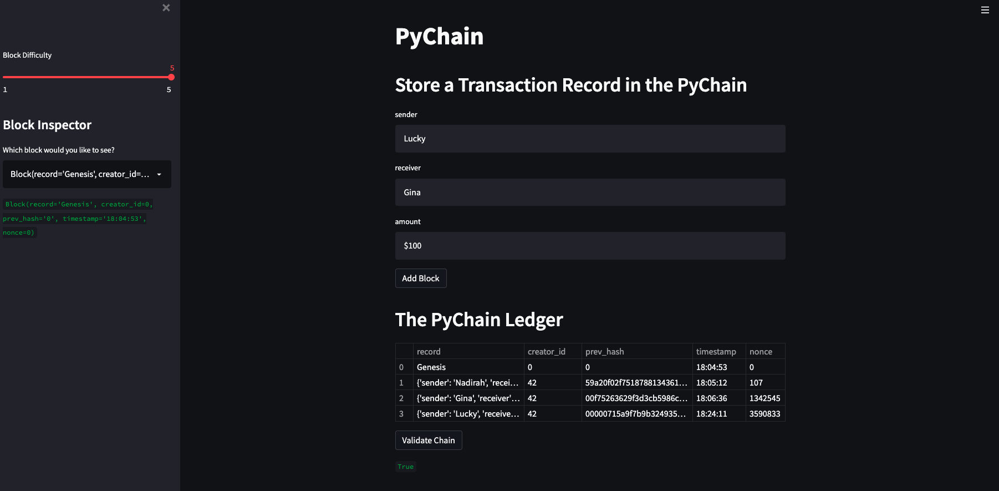

# Blockchain Ledger

This is a blockchain based ledger system which allow users to transer financial transactions between senders as well as verifys the integrity of the data in the ledger by checking the blocks validity. 

**This project was created using the following libaries and dependancies:**

* [python](https://www.python.org/) - programming language
* [pandas](https://pandas.pydata.org/)  - manipulation tool used for data analysis 
* [streamlit](https://docs.streamlit.io/) - python library that makes it easy to make custom user interfaces 
* [hashlib](https://docs.python.org/3/library/hashlib.html) - python library that secure hashes and message digests 

## Usage

Clone and run the application by using streamlit run pychain.py

##Examples

## Contributors

Nadirah Durr
nadirahcodes@gmail.com

## License
MIT
